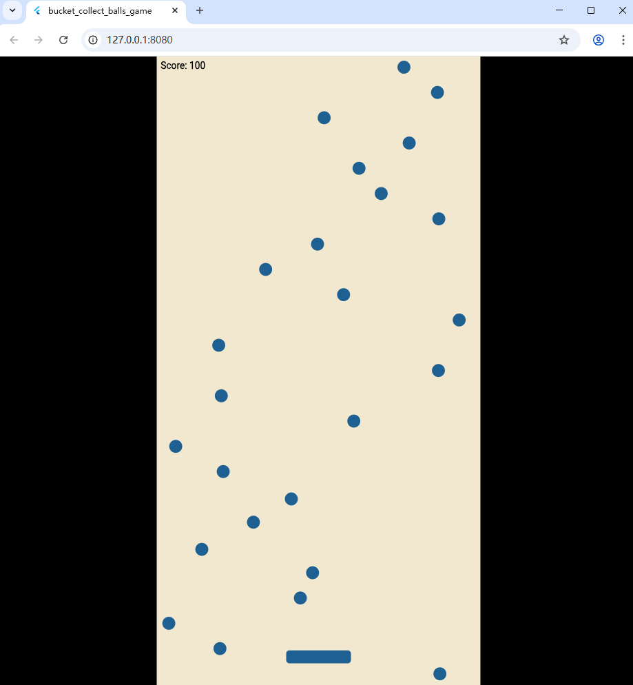

# bucket_collect_balls_game

# Hierarchy

Under the source directory, I have bucket_collect_balls_game as the game code.

The main is the entrance; the config is static configuration values. bucket_collect_balls_game is the game. 

Components consist of the ball, the bucket, the play_area as the boundary and components as the import collection.

Widgets have score_text to display the score.

# Screenshots

After initialization, the main invokes the bucket_collect_balls_game and then invokes the onLoad function. Game loads bucket on the bottom, score on the top left and swarmed balls drop off by a fixed time.

After the hit boxes of balls and bucket have collisions and was detected by ball, the ball instance add score by one immediately.

